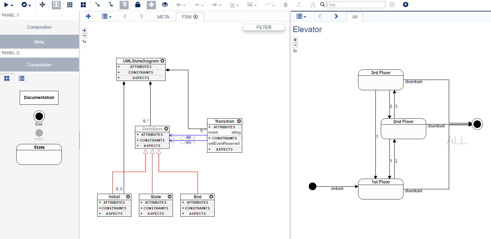

# Finite State Machine
[Finite state machine](https://en.wikipedia.org/wiki/Finite-state_machine) domain with seed, decorator and plugin for generating executable command line simulators in different languages.



## Run as a standalone webgme app
Make sure the [dependencies for webgme](https://github.com/webgme/webgme/blob/master/README.md#dependencies) are installed.
 1. Clone this repository and from the root of the repo do:
 2. `npm install` - installs all dependencies
 3. `npm install webgme` - installs webgme (it's a [peer-dependency](https://nodejs.org/en/blog/npm/peer-dependencies/)).
 4. Launch a local mongodb instance (if not local edit the webgme config).
 5. `npm start`
 6. Visit localhost:8888 from a browser.

## Import components into your own webgme repo
Using the [webgme-cli](https://github.com/webgme/webgme-cli) the following pieces can be imported (execute from root of repository).

#### Seed
Serialized model containing the finite-state-machine metamodel and some examples.
```
webgme import seed FiniteStateMachine webgme-finite-state-machine
```
#### Decorator
Decorates the states and transitions in a UML-like fashion. The seed already registers the decorator for the appropriate nodes.
```
webgme import decorator UMLStateMachineDecorator webgme-finite-state-machine
```
#### Plugin
Generates code from a state-machine. The seed registers the plugin for state-machines.
```
webgme import plugin FiniteStateMachine webgme-finite-state-machine
```

## Developers

#### Publish new release at npm
 ```
 npm prune
 npm install
 npm version 1.1.0 -m "Release %s"
 git push origin master
 git checkout v1.1.0
 git push origin v1.1.0
 npm publish ./
 ```
